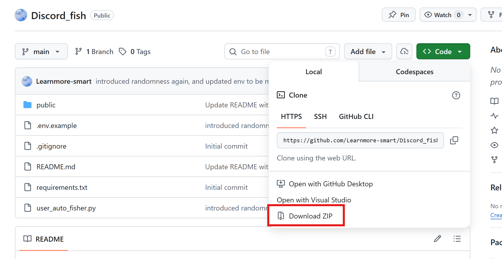
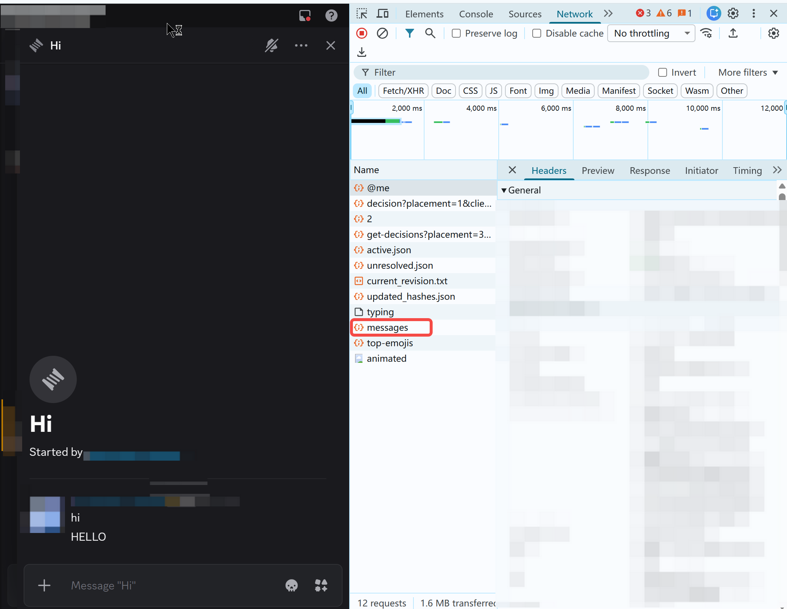
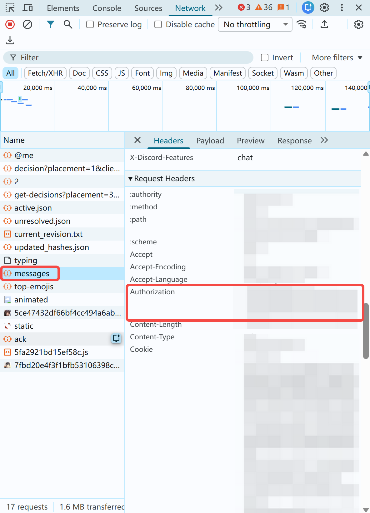
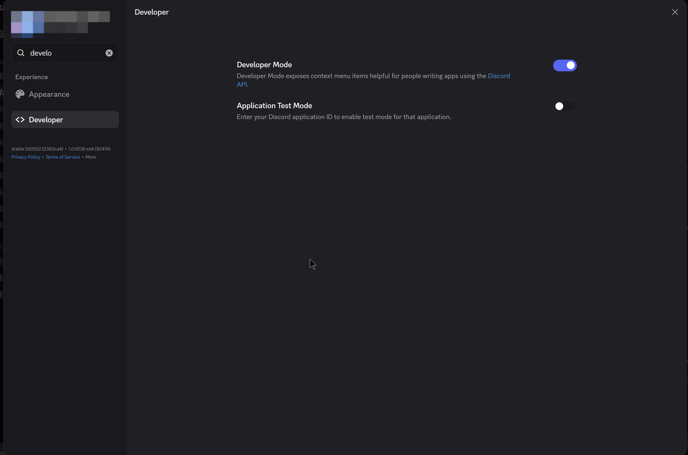
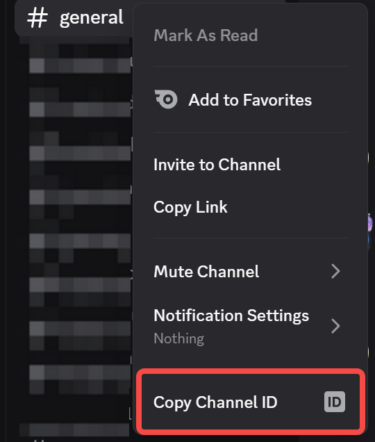
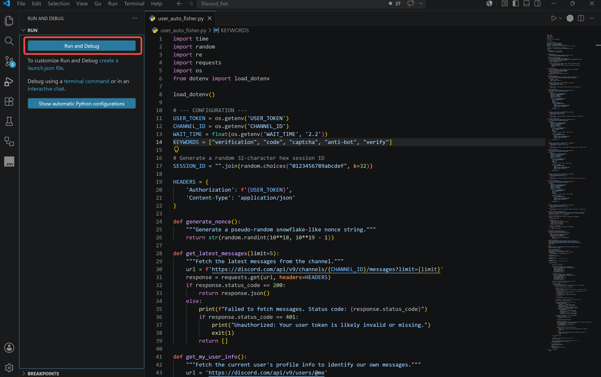
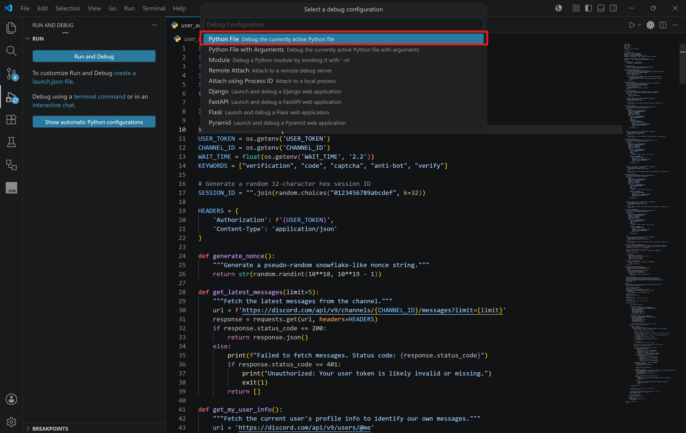

# Discord Virtual Fisher Auto-Bot

An automated Python script for sending `/fish` commands in Discord to play Virtual Fisher, with an anti-bot verification handler.

## Features
- Auto fish
- Auto sell
- Auto boost
- Auto verification

## On the way (might never come??? IDK):
- Auto check profile
- Auto buy rods
- Auto buy boats
- Auto upgrade

## Setup Guide

### 1. Download the Project
Go to the top of this GitHub repository, click the green **Code** button, and select **Download ZIP**. Once downloaded, right-click the file and extract (unzip) it to a folder on your computer.


### 2. Install VS Code and Python
1. Download and install **Visual Studio Code (VS Code)** from [code.visualstudio.com](https://code.visualstudio.com/). You will use this to edit the configuration files and run the bot more easily (though you can also just use Python IDLE if you prefer).
2. If you don't already have Python installed, download it from [python.org](https://www.python.org/downloads/) (version 3.7 or higher).
**Important:** During the Python installation on Windows, make sure you check the box that says **"Add python.exe to PATH"** at the bottom of the installer before continuing.

### 3. Open the Project in VS Code
1. Open VS Code.
2. Go to **File > Open Folder...** and select the unzipped project folder.
3. Open a terminal directly in VS Code by clicking **Terminal > New Terminal** in the top menu. This ensures you are in the correct folder!

### 4. Install Requirements
In the VS Code terminal you just opened, run:
```bash
pip install -r requirements.txt
```
If the command above says `pip is not recognized`, try one of the following alternatives:
```bash
python -m pip install -r requirements.txt
# OR
py -m pip install -r requirements.txt
# OR
pip3 install -r requirements.txt
```

### 5. Configuration
1. Still inside VS Code, look at the files on the left side. Right-click the `.env.example` file, select **Copy**, then **Paste**, and finally rename the copied file to exactly `.env`.
2. Open the `.env` file in VS Code and fill in your details:
   - `USER_TOKEN`: Your personal Discord account token (**DO NOT share this**).
   - `CHANNEL_ID`: The ID of the Discord channel where you want to fish.
   - `WAIT_TIME`: Time to wait between `/fish` commands in seconds. (Recommended `2.2` or higher).


**How to find your User Token:**
1. Open Discord in your web browser and press `F12` or CTRL+Shift+i to open Developer Tools.
2. Go to the **Network** tab.
3. Send a random message in any channel.
4. Click on the `messages` network request that appears.
5. Scroll down to **Request Headers** and find `Authorization`. Copy that value.



*DO NOT LEAK YOUR USER TOKEN, OR ELSE PEOPLE WILL BE ABLE TO ACCESS YOUR ACCOUNT FROM ANYWHERE!!!

**How to find a Channel ID:**
1. Enable **Developer Mode** in Discord (User Settings > Advanced).
2. Right-click the channel name where you want to fish and click **Copy Channel ID**.
How to get channel ID




### 6. Run the Bot
To run the bot in VS Code:
1. Make sure you have the `user_auto_fisher.py` file open and selected.
2. Click the Play/Run button in the top right corner of VS Code (see image below) or run this command in the terminal:
```bash
python user_auto_fisher.py
```



## Disclaimer
Automating user accounts (self-botting) is strictly against [Discord's Terms of Service](https://discord.com/terms) and might lead to your account being banned. Use at your own risk. The creator is not responsible for any banned accounts.