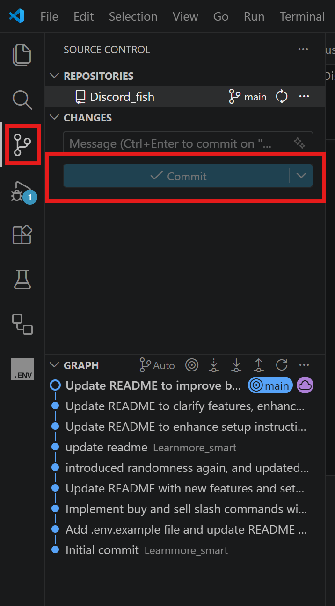

# Discord Virtual Fisher Auto-Bot

An automated Python script for sending `/fish` commands in Discord to play Virtual Fisher, with an anti-bot verification handler.

## Features
Basic feature:
- Auto fish
- Auto sell
- Auto boost
- Auto verification

Advance feature:
- **Auto check profile & state management**: Seamlessly checks profile and shops in the background every 30 minutes without pausing fishing.
- **Auto buy best available rods, boats, and upgrades**: Automatically exhausts available funds purchasing affordable items one by one sequentially.
- **Auto bait stocking (buys 50 of the best unlocked bait when below 10)**

## Configuration (Advanced)
The bot dynamicly executes commands using their slash command IDs. Default Virtual Fisher command IDs are built-in, but if Virtual Fisher changes their IDs, you can define them manually in your `.env` file (e.g. `CMD_SHOP_ID=...`, `CMD_PROFILE_ID=...`).

## Setup Guide

### 1. Install Prerequisites (Git, VS Code, and Python)
1. Download and install **Git** from [git-scm.com](https://git-scm.com/downloads). This allows you to easily download the project and keep it updated.
2. Download and install **Visual Studio Code (VS Code)** from [code.visualstudio.com](https://code.visualstudio.com/). You will use this to edit the configuration files and run the bot more easily.
3. Download and install **Python** from [python.org](https://www.python.org/downloads/) (version 3.7 or higher).
**Important:** During the Python installation on Windows, make sure you check the box that says **"Add python.exe to PATH"** at the bottom of the installer before continuing.

### 2. Clone the Project
By cloning the project instead of downloading the ZIP, you can easily receive updates whenever this script gets improved!
1. Open **VS Code**.
2. Go to **Terminal > New Terminal** in the top menu.
3. In the terminal, run the following command to download the project:
```bash
git clone https://github.com/YOUR_GITHUB_USERNAME/Discord_fish.git
```
*(Make sure you replace the URL with the actual GitHub link to this repository)*
4. Go to **File > Open Folder...** and select the newly created `Discord_fish` folder.

### 3. Open the Terminal in the Project
1. Once the folder is open, click **Terminal > New Terminal** again. This ensures you are in the correct project folder (`Discord_fish`) for the next steps!

### 4. Install Requirements
In the VS Code terminal you just opened, run:
```bash
pip install -r requirements.txt
```
If the command above says `pip is not recognized`, try one of the following alternatives:
```bash
python -m pip install -r requirements.txt
# OR
py -m pip install -r requirements.txt
# OR
pip3 install -r requirements.txt
```

### 5. Configuration
1. Still inside VS Code, look at the files on the left side. Right-click the `.env.example` file, select **Copy**, then **Paste**, and finally rename the copied file to exactly `.env`.
2. Open the `.env` file in VS Code and fill in your details:
   - `USER_TOKEN`: Your personal Discord account token (**DO NOT share this**).
   - `CHANNEL_ID`: The ID of the Discord channel where you want to fish.
   - `WAIT_TIME`: Time to wait between `/fish` commands in seconds. (Recommended `2.2` or higher).


**How to find your User Token:**
**Important Note:** Your personal token is different depending on whether you are using Discord in the browser or the Discord Desktop App.

If you are using the Discord Desktop App, Discord has disabled Developer Tools by default. To enable it, completely quit Discord first, then find your `settings.json` file:
- **Windows:** Press `Win+R` to open the Run prompt, type `%appdata%/discord/` and press enter. Open the `settings.json` file in Notepad or VS Code.
- **Mac:** Navigate to `~/Library/Application Support/discord/` and open `settings.json` in a text editor.
- **Linux:** Navigate to `~/.config/discord/` (or `~/.discord`) and open `settings.json` in a text editor.

Above the `}` at the bottom of the file, add `"DANGEROUS_ENABLE_DEVTOOLS_ONLY_ENABLE_IF_YOU_KNOW_WHAT_YOURE_DOING": true,` so it looks something like this:
```json
{
  "DANGEROUS_ENABLE_DEVTOOLS_ONLY_ENABLE_IF_YOU_KNOW_WHAT_YOURE_DOING": true,
  "IS_MAXIMIZED": true,
  ...
}
```
Save the file, reopen the Discord app, and press `Ctrl+Shift+I` (or `Cmd+Option+I` on Mac) while in Discord to open Developer Tools.

If you are using Discord in your web browser:
1. Open Discord in your web browser and press `F12` or `Ctrl+Shift+I` (or `Cmd+Option+I` on Mac) to open Developer Tools.

Next steps for BOTH app and browser:
2. Go to the **Network** tab in the Developer Tools.
3. Send a random message in any channel.
4. Click on the `messages` network request that appears in the list.
5. Scroll down to **Request Headers** and find `Authorization`. Copy that value.


*DO NOT LEAK YOUR USER TOKEN, OR ELSE PEOPLE WILL BE ABLE TO ACCESS YOUR ACCOUNT FROM ANYWHERE!!!

**How to find a Channel ID:**
1. Enable **Developer Mode** in Discord (User Settings > Advanced).
2. Right-click the channel name where you want to fish and click **Copy Channel ID**.
How to get channel ID


### 6. Run the Bot
To run the bot in VS Code:
1. Make sure you have the `user_auto_fisher.py` file open and selected.
2. Click the Play/Run button in the top right corner of VS Code (see image below) or run this command in the terminal:
```bash
python user_auto_fisher.py
```


### 7. Updating the Bot
If the author puts out a new update, you don't need to do the whole process again! Simply:
1. Open the project in VS Code.
2. Click on the **Source Control** icon on the left sidebar (it looks like a branch/graph).
3. Click the **Sync Changes** (or **Pull**) button.

*(Alternatively, you can open a terminal and run `git pull`)*

The bot will automatically download any new improvements while keeping your `.env` settings safe!

## Disclaimer
Automating user accounts (self-botting) is strictly against [Discord's Terms of Service](https://discord.com/terms) and might lead to your account being banned. Use at your own risk. The creator is not responsible for any banned accounts.